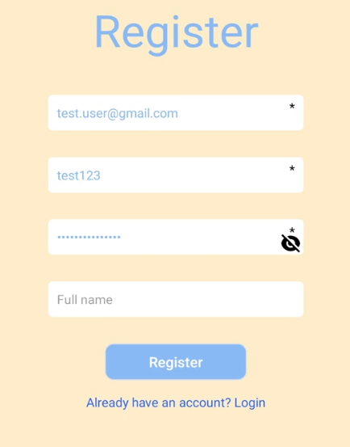
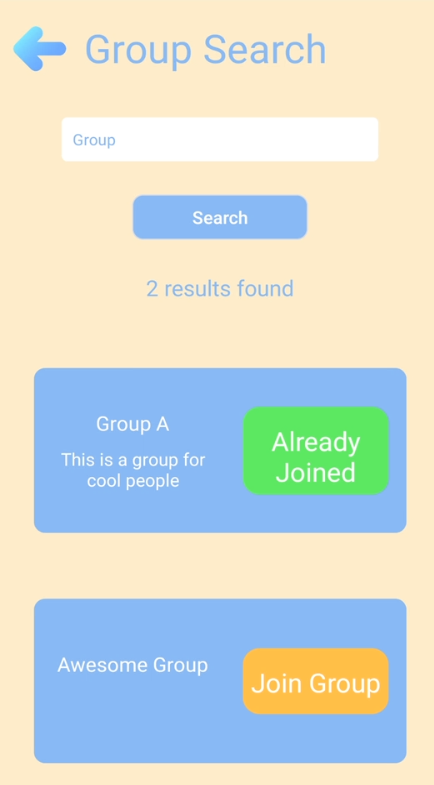
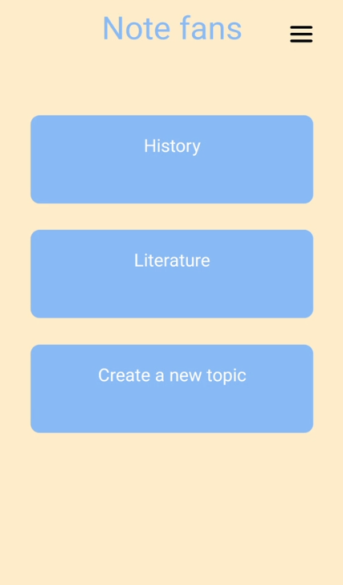
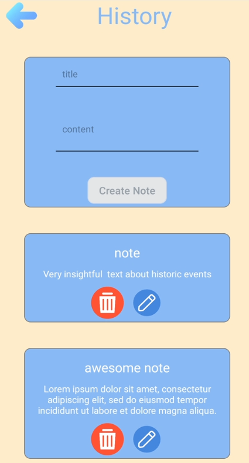

# Note Sharing App

## About

This mobile application allows you to create groups for keeping everyones notes all in one place.

## Motivation

This project was created in order to practice making a large scale full stack project.

## Next

The application currently doesn't provide anything that other applications don't already do but it could be developed further to fill in a niche. At the moment there aren't any active plans for further development but that could change given the right opportunity.

## Tech

**Application**

-   React native

[Rest API](https://github.com/RikuVesanto/Note-Sharing-App-Backend)

-   Node.js
-   Typescript
-   Typeorm

## Screenshots

## Features

-   Register
-   Login
-   Create groups
-   Search & join groups
-   Browse groups you are in
-   Create topics
-   Create notes
-   Remove users from group as admin
-   Relinquish admin rights to someone else
-   Delete and edit notes
-   Edit topics title
-   Edit group name
-   Edit user information
-   Change password
-   Change language

## Target platform

The application can be run on both android and ios though so far it's only been tested on android

## How to use?

Currently there is no live version of the app as it's not yet providing anything unique other apps couldn't provide as well.
